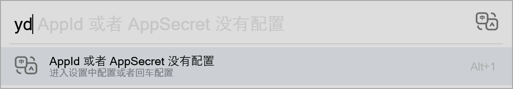

==================

# 有道翻译

A plugin for the [Flow launcher](https://github.com/Flow-Launcher/Flow.Launcher).

> 这个翻译接口是要钱的. 但正常个人使用应该不会超的.一年可能都用不了2块钱.

### 说明

中英互译

### Usage

    yd <arguments>

### AppId/AppSecret申请

1. 在 https://ai.youdao.com/ 注册帐号.登录
   
   1. 新用户注册送50块,一般正常使用是不会超的.

2. [有道智云控制台](https://ai.youdao.com/console/#/)

3. 文件翻译=>创建应用

### 配置

#### 方式1

设置 -> 插件 -> YoudaoTranslate -> 配置AppId/AppSecret

#### 方式2

没有配置 `AppId/AppSecret` ,使用 `yd` ,然后回车也可直接配置.

### Icon来源

https://www.iconfont.cn/